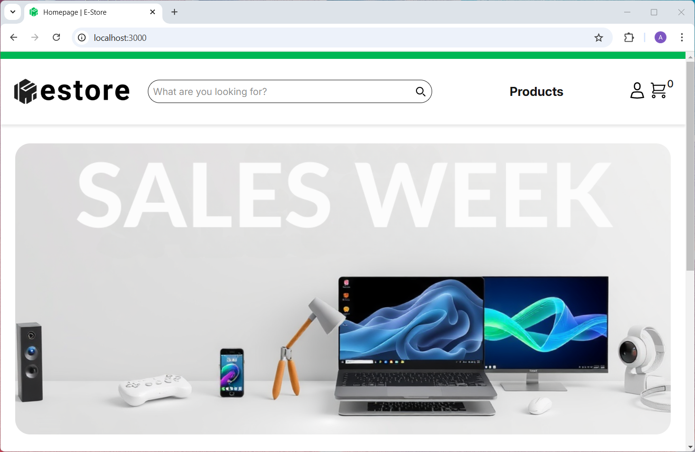
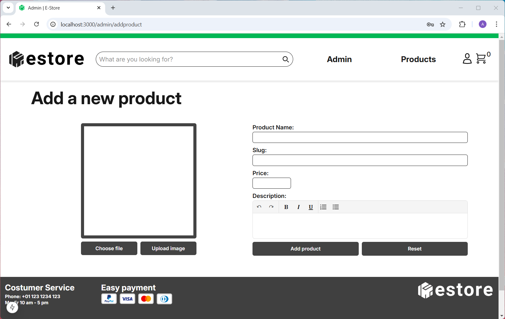

# Next.js Ecommerce Store

Simple online store where the contents of the shopping cart are saved in a cookie. There is also an admin function where new products can be added and existing products can be edited.




## Technologies

- Tailwind
- NextAuth
- Cloudinary
- Next.js
- Postgres
- Jest
- Playwright
- Fly.io

## Database Setup

If you haven't installed PostgreSQL you can follow the instructions from UpLeveled: https://github.com/upleveled/system-setup/blob/main/readme.md

Copy the contents of the file .env.example to a new file .env (which should be ignored by GitHub) and fill in all the information. This is not only important for the database to run but also for NextAuth and Cloudinary to function properly.

## Windows

When you are asked for the password use "postgres".

```
psql -U postgres
```

## macOS

```
psql postgres
```

When you have established a connection execute the following to create the database:

```
CREATE DATABASE <database name>;
CREATE USER <user name> WITH ENCRYPTED PASSWORD '<user password>';
GRANT ALL PRIVILEGES ON DATABASE <database name> TO <user name>;
\connect <database name>
CREATE SCHEMA <schema name> AUTHORIZATION <user name>;
```

Quit psql using the following command:

```
\q
```

For the next step make sure that your current working directory is the folder of the project (use the cd command to change the folder if necessary). Please also note that you need to have pnpm installed. Now run the migrations command to automatically create the table and insert some demo products:

```
pnpm migrate up
```

## Tests

### Jest

```
pnpm jest
```

### Playwright

```
pnpm playwright
```

## Deployment

The project is deployed on Fly.io
